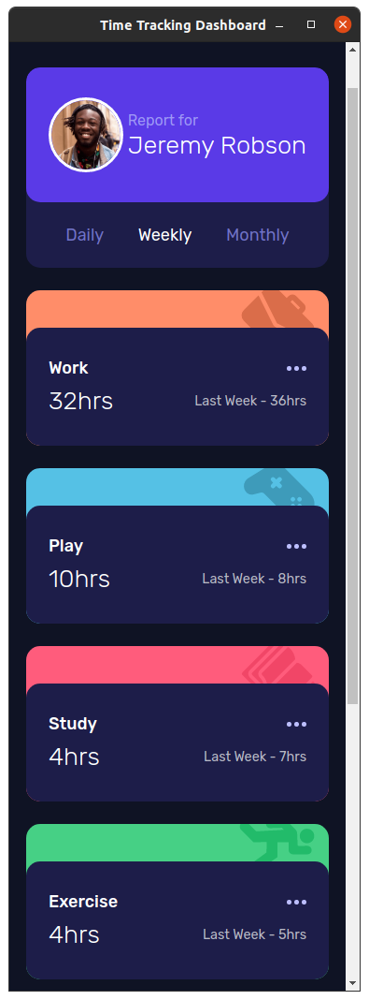

# Frontend Mentor - Single price grid component solution

Esta é a minha solução do desafio "[Time tracking dashboard](https://www.frontendmentor.io/challenges/time-tracking-dashboard-UIQ7167Jw)". O desafio consiste em criar um dashboard de organização do tempo segindo o design, onde o usuário pode escolher o período de consulta.

[Link para a solução](https://matheusg18.github.io/order-summary-component/)

## Table of contents

- [Overview](#overview)
  - [Desafio](#desafio)
  - [Screenshots](#screenshots)
  - [Gifs](#gifs)
- [Desenvolvimento](#desenvolvimento)
  - [Tecnologias usadas](#tecnologias-usadas)
  - [Aprendizados](#aprendizados)
- [Contato](#contato)

## Overview

### Desafio

Os usuários devem ser capazes de:

- Ver o layout que se adequa ao tamanho da sua tela
- Ver efeitos de _hover_ nos elementos interativos
- Mudar entre a visaõ Daily, Weekly e Monthly

### Screenshots

#### Layout mobile

#### Layout em 1024x768

### Gifs

#### Efeitos de _hover_ e _active_

## Desenvolvimento

### Tecnologias usadas

- JavaScript
- React
- HTML5
- SASS
- CSS
- Mobile-first

### Aprendizados

- SASS
- SASS com React
- SASS lists
- SASS loops
- Media querries por classe

## Contato

- Portfólio - [Matheus Santos](https://matheusg18.github.io/)
- Frontend Mentor - [@matheusg18](https://www.frontendmentor.io/profile/matheusg18)
- Linkedin - [@matheusg18](https://www.linkedin.com/in/matheusg18/)
